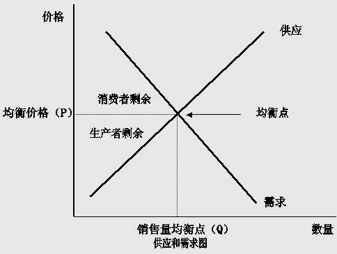

## Token的供给和需求

### Token的供给

#### 设计Token供给的目的

设计Token供给很重要，它是实施Token激励的工具。通过Token供给的策略，提供有价值的Token，激励引导或者惩罚参与者在网络中的行为。此外，通过Token供给政策，还可以设计激励机制来吸引消费者、生产者、投资者和网络贡献者。

  本质上，Token供给的设计需要回答四个主要问题：

  1. 总供应量是有限的还是无限的？

  2. 怎么增加或者减少Token的供给？

  3. 是否应该限制某些Token的转让？限制谁？以及多少时间？

  4. 更新设计的决策流程是什么？

#### Token的发行

* **如何设置Token的总发行量，各个参与者又该如何进行Token的分配？**

  首先，Token的总量发行有两种方式：**a)设置有限供应 b)设置无限供应**。今天仍有很多关于哪个方法更好的辩论，但实际上，方法取决于具体应用。例如，比特币最大供应量有限，在未来，不会再增发比特币。有些人认为，这会刺激大家持有比特币而不是消费，从而使比特币成为“存储价值”货币，而不是“支付媒介”的货币。这里的原因是，如果比特币供应在未来没有增加，那么相对其它增加供应的Token，比特币将能够更好地保持价值。但这样做的问题在于，它激励了用户持有比特币，而不是消费比特币，这对那些希望比特币，是以商品服务进行交易的人们来说并不是很理想。

  还有一些人认为应该设置无限供应，通货膨胀的供应，更适合想要用于消费经济的Token，假设需求是不变的，它会随着供给的增加而失去价值，因此这是一个激励消费而不是持有的设计。

  还有一个重要的考虑因素是**激励矿工**。由于比特币是固定的总供应量，未来矿工将无法获得挖矿奖励，就只能依靠交易费来激励并维护网络安全。但我们也不知道，未来的交易费是否足以激励矿工，通过硬件的方式来保护比特币网络，因此，对于一个网络，构建Token的供应方式实际上取决于，是否需要矿工，以及你的Token有什么使用场景。

  下面是一个如何设定有限Token供应的案例。如果你是想，通过众筹Token，来为项目开发者提供资金，那么设置总量的一种方法是从计划募集多少资金来进行倒推。

  举个例子，你的项目想众筹1000万美金，那么Token总量该设计为多少呢？购买的用户、创始团队等参与者在创始区块中分别占有多大比例的Token呢？

  根据以往项目的经验，众筹占总Token量的比例，可以控制在20%到30%。也就是说，1000万美金可以买到你项目的20%的Token总量，用Token总量来算你项目的总市值，就是5000万美金。把这个市值和你的竞争对手做比较，大概就会知道你的市值是不是合理了。在做这个比较的时候，你可能要拿创世区块时的总量来比，这样就会更准确些。

  创始团队的Token持有比例一般在10%左右，顾问和其它贡献方低于5%。

  **除了投资者、创始团队、顾问的部份以外，剩下的Token必须用作激励，也就说大部份Token都是用于激励的**。很多明星项目都保留了很高比例的Token来做激励。到目前为止，**最成功的去中心化系统，比特币网络中，100%的Token都用于激励。**

* **那么Token的单价怎么定呢？**

  这个值比较灵活，是基于项目方自己对Token单价的偏向。比如你觉得每个Token的价格为一美元比较合理，你的项目市值是5000万，那你的Token总量就应该是5000万个。如果你觉得每个Token0.1美金合适，在市值不变情况下那么Token总量就应该是5亿个。

* **举个栗子：理解Token的发行**

  为了更好地理解Token的发行，我们以去中心化存储项目Filecoin来举例

  Filecoin的Token中70%都用于激励。因为在Filecoin的网络中，核心资源的是存储空间，挖矿者提供存储空间，自然应该获得奖励。这里我们应该注意，不管你的项目是搭建一整个网络还是应用，首先你都要明确自身最重要的资源是什么，同时这个资源由谁来提供，最终想明白怎样激励这些人来提供这些资源。

  10%的Token分配给了投资人。用来给项目提供发展所需要的资金，和激励不同的人来拓展该网络。

  还有5%的Token给了社区支持者和开发者，因为Filecoin是一个开源社区，Token激励可以吸引不同的人来参与和贡献到该生态中。

  剩下还有15%的Token给到了Protocol Labs(中文名为协议实验室)，也就是Filecoin的创始团队，主要用于研究开发以及市场运营。当然，Filecoin是一个开源项目，早期的确需要实验室的存在，也需要社区的维护，但最终还是希望通过Token激励整个社区的参与者进行开发和维护它。

  另外，大家可以注意Filecoin采用的归属期（vesting period)政策。归属期是指你的Token逐步被释放出来的时间周期。设置归属期的目标是确保Token的持有者在项目中停留更长的时间。在Filecoin的设计中，投资者的归属期在六个月到一年，协议实验室和基金会都是六年。

以上就是**Token供给中的“发行”部分，包括怎么设定Token总量、Token分配给谁以及如何分配**。**分配给谁这个问题很重要，因为谁持有Token，谁就会有动力去参与这个系统的建设**。

#### Token的抵押

* **设计Token供给需要考虑的第二个方面是抵押**

  **一旦Token被抵押，这些Token就不属于流通供给量（circulating supply),被抵押的Token相当于被冻结在持有人的地址中**。

  最近有很多项目都在通过一些激励手段去鼓励人们去抵押Token。比如Dash的超级节点，只要你抵押它的Token就可以参与该节点的挖矿过程；在Ethereum Casper里，你要抵押Token才能成为一个验证节点；在Dfinity中，你要抵押Token才能挖矿，才能参与治理和投票；但在唯链中，你需要持有它的VET Token才能获得它新增的VHTO token。

#### Token的销毁

* **设计Token经济时需要考虑的最后方面，是Token的销毁**

  在设计Token经济时还需要考虑，是否用Token销毁来当激励，也就是消耗掉Token。虽然销毁不是强制性的，但它是控制供应和奖励某些活跃持有者的一种策略。

  举几个例子：

  前面提到币安的BNB，BNB每个季度20%的利润，回购市场上的Token，然后把这些市场买回来的token发送到一个不可回收的地址上，相当于把这些Token销毁。这个方法可以减少流通的数量，以支撑BNB的价格。

  另外一个有趣的例子是Factom。Factom有一个平衡模型，叫“Burn-and-mint Equilibrium”。用户使用Token支付，并不是转账到哪里，而是直接销毁。这相当于制造了token供应的短缺。如果用户不断的增长，使用Factom的token频次增加，销毁的token就更多，稀缺性变强，推动token的价格上升。此外，如果网络上的交易量很低，那么更多的token就会被挖出来，增加供应，这可能会使token的价格回落。

#### 治理

除了上面提到的问题以外，token设计者还要考虑，如何修改上述token数量政策的规则。这就是所谓的治理。治理是非常重要的，举例来说，一旦你建立了发行政策，那谁有权利和责任来改变它呢？目前来看，项目要么实施“链上治理”，使用token投票来表决政策的变化，要么使用“非链上治理”，通过基金会、开发者或公司来决定规则的变化。

### Token的需求

#### 什么是“Token的需求”

我们先看一下，在经济学里，是怎么定义“需求”的。经济学中的需求，是指在一定的时期内，在一定的价格水平下，消费者愿意并且能够购买的商品数量。

那么在token经济中，token需求就是用户对token的需求总量。token需求大概可以分为两类：一类是使用token在网络里交换商品和服务，另一类是通过token接收参与网络时获得的收益。

这里要强调的是：token只是用户使用你的基础网络，或产品时的一个媒介而已。要么用户使用你的token来买服务，要么商户使用你的token来提供服务给用户并赚钱。这就是驱动token需求的核心点。通常来说，你的基础产品做的越好，就会有越多的用户对你的token产生需求，因为用户需要通过token来接触这个产品。反过来，如果你的产品体验很差，那么不管你设计再多的激励，也永远不可能创造出长期的token需求。

但是，目前大部分人对token的需求还停留在“炒作”和“投机”，真正的token需求被这些表面现象遮掩了，这让人们对token有很大的误解。token作为激励的一种方式，有很大的存在意义。

#### 设计Token需求的目标

* 目标有两种：

  * 第一，让token的持有者带来赚钱的机会和使用价值。如果我持有token，，而且我通过token的权益，可以工作赚钱，我当然会有动力购买它。另外，如果我持有token，可以用它来买独特的产品，或享受更便宜的服务，我就有动力购买它。

  * 第二，用token来激励网络或dApp的活跃度。也就是说，用token来激励新用户注册，和提高用户的活跃度。一个token的价值，体现在参与者在网络中的活跃度。这些网络活动加起来，就是一个经济体。网络中的活动越多，比如说服务供应商和服务用户之间的交易越多，这个经济体和它的token的价值就越高。再说具体一点，就是一个网络或一个dApp被使用的越多，就有越多交易发生，而如果处理每笔交易都用到token，那么token的需求就越多。

#### Token的需求分类

  一个基本的经济体就是一群消费者和生产者，他们购买和销售商品和服务。因此，设计一个好的token经济，关键是列出网络经济中可以交换的所有可能的数字商品和服务，然后根据这些设计token。

  我们提到过，我们把**用户对token的需求分为两类：一是使用token在网络里交换商品和服务，这一类叫做token的购买需求；二是通过token接收参与网络时获得的收益，这一类叫做token的资本收益需求**。

  * token的购买需求
  
    首先来看token的购买需求。我们可以将购买需求进一步拆分，也就是使用token购买和使用token出售的需求，分别创造了消费侧需求和生产侧需求。消费侧需求是指购买token来消费网络商品和服务的需求；生产侧需求是指购买token来提供赚取利润的商品和服务的需求。消费侧和生产侧的需求都推动了token的购买需求。而创造强劲的token购买需求可以帮助token维持购买支持，这是定价的重要驱动因素。

  * token的资本收益需求
  
    除了token的购买需求之外，另一种token需求是资本收益需求。这仅仅是因为相信token会升值（通过像BNB这样的回购或投机信仰），或者因为token保证一些回报给持有人（如空投或利润分享）。

  除了设计购买需求外，重要的是要为用户设计足够的渠道来实际获取token。目前，token常见获取方式主要包括购买、兑换、挖矿、行为激励4大常见方式，购买主要指通过现金购得所需要的token；兑换包括利用一类token换取一定量的等值token，也是当下最常见的一类；挖矿和行为激励其实很像，都是需要通过做出贡献来获取对应的token，这是token经济良性发展的重要支撑。

#### 如何提高token的购买需求

  总结一下，**设计token需求的要点就是首先从生产侧和消费侧提高token的购买需求，同时设计足够的渠道来让用户获取token**。

* **提高生产侧token需求**

  让我们先来讨论一下如何从token需求的生产侧来提高token需求。token经济中的生产者通过向网络经济用户出售和贡献资源而赚取token。

  对于一个在生态系统中的生产者，他需要贡献自己的资源才能参与到网络之中，包括贡献存储、贡献算力、参与系统开发、推荐新用户等。生产侧需求是指购买token的欲望产生的购买需求。创造生产侧需求的一种方法是要求生产商在网络上提供服务之前获取和持有token。这些服务应该为生产者从费用和奖励中获得利润。有两种类型的生产者参与权可以设计成token：计算机网络参与权和商业网络参与权。计算机网络参与权的一个例子是，像Cosmos中的token-Atom一样，抵押Atom才能获得验证的奖励。商业网络参与权的一个例子是，押注以获得执行其它工作的收益权，如Augur中的token REP。

  为了吸引消费者到经济中来，并使持有token对生产者而言有价值，你需要找到方法来吸引早期生产者到经济中来。简而言之，就是从如何吸引用户提供资源、让这个网络增长的角度来思考。做到这一点的最好方法之一是使用token奖励，激励生产者贡献资源。

  * 举个栗子：

    接下来举一个从生产侧出发设计token需求的例子方便大家理解。在Steem网络中，用户可以通过写文章和点赞来获得token收益；2018年大火的交易所Fcoin同样是这类路径，所谓的“交易即挖矿”便是对用户行为的反馈来做出激励，从而获得token。

    在Fcoin的例子中，token的设计者认为交易量是他们希望参与者能贡献的重要资源，所以Fcoin系统会根据用户贡献的交易量来发放相应的token-FT作为奖励。但不幸的是，由于Fcoin的激励体系导致了“坏的增长”，所以它是不可持续的。“坏的增长”是说有人为了获得奖励大量去“刷”假交易量，最后导致平台流失用户。设计token经济时最难的部分，就是去权衡在早期为了增长用户，你的网络应该采用多大强度的激励。如果这一点设计的不恰当，你就会吸引错误的用户，带来“坏的增长”，这可能会给网络带来风险。Fcoin另外一个没做好的点，是它没有给FT设计出足够价值。它的购买需求不强。如我刚刚提到的，token的购买需求是来自于它是否有足够的赚钱机会，不仅仅是投机升值赚钱机会。

  如果说token代表了数字资产和权益，根据当下社会经济的发展，获得途径应该偏向劳动或者付出，从而获得相应的资产，同时随着参与度的提高，在权益方面获得相应的回报。这样的一个经济体才是健康的，其token的需求也不会时高时低，token价值也不会发生剧烈的波动。

* **提高消费侧token需求**

  如何提高消费侧token需求。简单地说，token需求的消费侧是由使用token可以消费多少不同的商品和服务，也就是说你所有使用token的方式驱动的。这里所说的商品和服务包括支付智能合约交易费、账户转账交易费、支付应用程序服务等。在考虑token的获得渠道后，我们还需要慎重地考虑如何让用户获得token之后有使用途径，而不仅仅是囤积token获利。当然，如果用户有意将token作为一种升值资产持有，并不是不可以，但对另一部分人来说，token还需要有一个合理的使用空间，也就是消费和使用路径。

  那这个就是从提高使用token频率的角度，来思考对提升token需求量的办法。在这方面，我们首先需要考虑一个项目提供什么样的服务，以及可以对什么样的参与者收取token或者要求抵押token？其次，谁愿意接受token作为收入？这个项目发行的token和法币的关系是如何的？是否有通畅的法币兑换通道？如果没有的话，很难建立一个合理的经济模型，这一点对于目前的中国来说还很难，但虽然如此还是有一些中国项目，在现有的合规框架之下可以发展的很好。

   我们从一些交易所的平台积分来看，这类token在满足流通属性的前提下，还加入了抵扣手续费的特性，这也算是一种token消费路径，至于持有积分的分成，也勉强算是获得了权益认可。只是这些“薅羊毛”般的数量完全不能满足持有者的胃口，这也是为什么会有一些交易所，针对自家的积分推出了一系列的“锁仓机制”，利用未来的预期，来减少token的流通量。

  为了理解锁仓机制的原理，我们来分析一下供需情况，你可以参考文稿中的供需曲线来学习，请拿出一张纸，跟着我一起画出一个横坐标和纵坐标，横坐标代表数量，纵坐标代表价格。再画一条从左上到右下的需求曲线，和一条从左下到右上的供应曲线。两条线的交点就是供应和需求的均衡点，对应着均衡销量和价格。当供应减少时，供给曲线左移，即使需求不变的情况下，价格也会相应的升高，这是最简单的理解那些锁仓机制的积分玩法。当然，如果再刺激需求的增加，最后均衡的价格还会有所抬升。

   

  一个健康的经济体大多数情况下都是随着市场的波动而发生相应的变化，这也是理解token价格最基本的锚定点。但赋予token合理的使用空间，也是影响需求的重要因素，如果用户只有获得token的路径，没有合理消费token的路径，并不能让token价值真正体现出来。这是因为消费token时，通常会为网络上的服务提供商创造收入，从而激励更多生产商加入网络并加强经济。

  反过来看，既然获得路径可以是行为性的获得，那么消费路径理论上也要遵循该原则，即行为或价值的转换必然要消耗一部分token，可以是价值的获取、使用权的转移或者物品的索取都会带来消耗。消费路径的缺失往往会使得整个token系统受到单边价值下降的影响，即使是有价值的token，最终也会遭到用户的抛弃。

  正因如此，我们在观摩一个token价值的体现就要去平衡获取端和消费端的影响，尽量找到一个平衡点使得流入和流出的价值在某个健康的比例内，否则就会造成类似Fcoin和火牛频这样的悲剧发生。Fcoin失败的原因在于忽略了消费侧和生产侧（consumption-side and production-side demand）的真正需求，用户没有任何持有token的长期价值，所谓的分红也是在剥削后来者的价值，这种机制当然会遭到市场的猛烈打击。

  目前的token消费路径大多停留在售出的层面，或者作为费用的抵扣，并没有考虑如何为一个经济体赋能，如何让token持有者享受到消费的乐趣。很大程度上，token设计者居然左右不了消费路径，但规则的制定和效益的锚定还是能够为社区发展带来合理的方案，否则消费路径的缺失会将整个token价值引导为螺旋向下的状态。

  token消费路径的设计需要衡量token获得路径，借此来平衡两者之间的关系，包括量级、维度、制约情况等等。因为消费路径关乎着整个token价值的“输出端”，而“输出端”是指如何消费token，从而带动token价值发展螺旋向上，这是在设计token消费路径前需要考虑的一个重要问题。

  提高token购买需求的第二个方式，也就是提高token消费侧需求，简单地说，就是让token更多地被使用。

* **利用token建立“病毒循环”**

  除了有合理的购买需求以外，一个成功网络经济需要建立一个正反馈的“病毒循环”（viral loop）。

  病毒循环的建立也可以用token来帮忙。“病毒循环”（Viral loop）一词来源于亚当.潘恩伯格（Adam L.Penenberg）的书，在书出作者讲述了包括Netscape、eBay、PayPal、YouTuBe、Facebook、Twitter在内，全世界最成功企业依靠病毒循环发展状壮大的故事。

  * 什么是病毒循环？

    事实上，病毒循环是一种营销手段，指的是利用和类似病毒感染的方法，利用激励机制，将产品的“受体”转化为“主体”，继而“感染”更多的新受体。它主要的目的是用来加快网络的增长速度。

    也就是说token的发行需要吸引新用户参与，新用户的参与者越多，越能完善这个项目的生态，进而吸引更多用户参与。

   比特币的机制就是一个很好的案例：

  比特币病毒循环的第一步，是发行一些新的token，这些token是一些资源生产商的收益，在比特币中资源生产商是矿工。参与挖矿可获得收益，这会吸引更多的矿工参与进来，进而就会提高比特币网络的安全性。因为越多的矿工参与记账，则篡改交易需要的算力也就越高，实际上也就降低了交易被篡改的概率，因而保障了系统的安全性。比特币系统的安全性越高，就越能吸引更多的用户到这个网络中来交易。用户数量越高，交易量就越大，那这个token系统的估值也就越高，token升值也提高了矿工的报酬，从而进入下一个循环。

就像我们开头讲到的那样，token对消费者或者生产者的价值，直接取决于网络中用户的数量和用户的活动。因此，为了增加需求，我们应该设计增加网络活动的token激励机制。提升网络使用量主要有两种方式。第一种是吸引更多新用户，第二种是提升重复使用率。比如一些平台币，如果你的交易量达到一定数值后，你可以获得一定折扣，它会激励你去多交易。在传统的商业活动中，企业会通过顾客忠诚度计划来激励顾客多消费，英文是customer loyalty program，中国指积分系统。如酒店、航空公司、餐厅等商业机构推出的积分卡等等，都是为提升用户忠诚度。有很多具体的方式，如消费满多少钱可以获得一定折扣；或者买五赠一、买十赠一；或者达到一定消费量可以获得一个奖励或礼物；或者设置等级，不同的等级拥有不同的权利等等。

  在设计token经济系统的时候，前面这些传统商业中的作法，都可以给我们很多借鉴和方向。比如，你可以要求先抵押一定量的token才可以让新会员参与网络协作，比如做一个矿工等等。第二种情况是类似于BNB这种平台币，如果你的交易量达到一定程度，就可以获得一定的折扣。第三种情况是给予拥有token的用户一些特定权力。美国有个PROPS的区块链项目，去年通过CoinList进行了私募，它大致可以理解为一个去中心化的YouTuBe，持有token的内容生产者，可以使用token来接广告、让自己创造的内容优先被展示等。

#### 总结

一个好的token价值结构，一定会在需求端费尽心思去打磨，保证该经济体系内，不会因为需求的变化而影响到整个token价值。当然需求的打磨跟产品经理，通过需求打磨产品很类似，只不过还要加入经济的设定，因为token的资产性和权益性是互联网产品所不具备的。

----
_本文参照 Ben El Baz 关于激励设计的课程讲座所写_