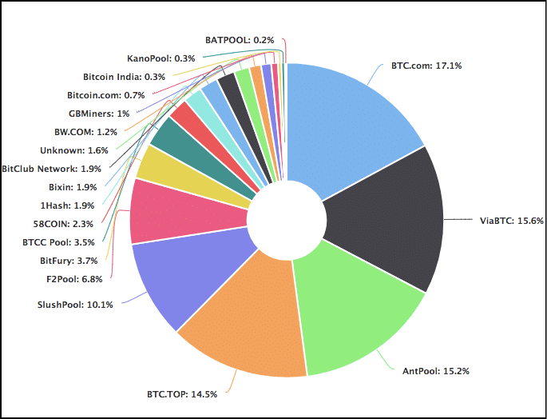
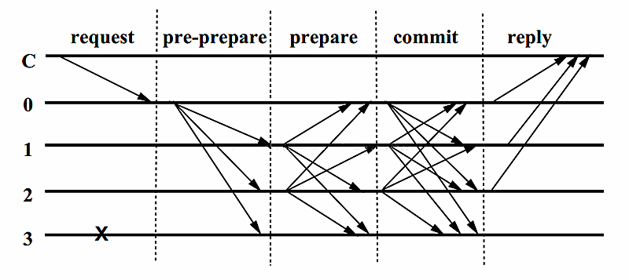
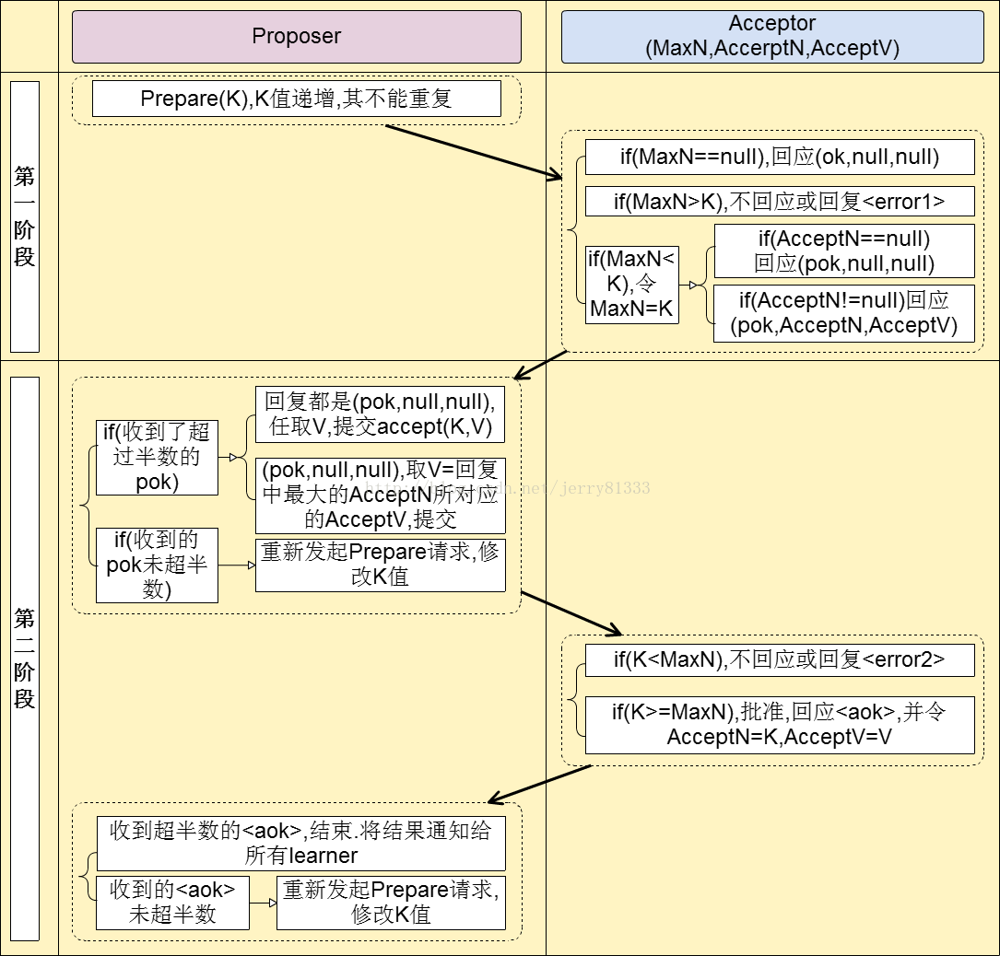

## 共识机制

区块链能够不依赖中间可信方达成可信共识，解决了在不可信信道上传输可信信息、价值转移的问题，而共识机制则解决了区块链如何在分布式场景下达成一致性的问题。区块链的伟大之处就是它的共识机制在去中心化的思想上解决了节点间互相信任的问题。区块链能在众多节点达到一种较为平衡的状态也是因为共识机制。尽管密码学占据了区块链的半壁江山，但是共识机制是保障区块链系统不断运行下去的关键。

在分布式的思想刚被提出来时，人们就开始根据[FLP定理][1]和[CAP定理][2]设计共识算法。

[1]: https://www.jianshu.com/p/6169ba76429e
[2]: https://www.jianshu.com/p/6169ba76429e

* 规范的说，理想的分布式系统的一致性应该满足以下三点：

1. 可终止性（Termination）：一致性的结果可在有限时间内完成。
2. 共识性(Consensus)：不同节点最终完成决策的结果应该相同。
3. 合法性(Validity)：决策的结果必须是其他进程提出的提案。

* 但是在实际的计算机集群中，可能会存在以下问题：

1. 节点处理事务的能力不同，网络节点数据的吞吐量有差异
2. 节点间通讯的信道可能不安全
3. 可能会有作恶节点出现
4. 当异步处理能力达到高度一致时，系统的可扩展性就会变差（容不下新节点的加入）。

科学家认为，在分布式场景下达成完全一致性是不可能的。但是工程学家可以牺牲一部分代价来换取分布式场景的一致性，上述的两大定理也是这种思想，所以基于区块链设计的各种共识机制都可以看作牺牲那一部分代价来换取多适合的一致性，在这种思想上进行一个灵活的变换，即在适当的时间空间牺牲一部分代价换取适应于当时场景的一致性，可以实现灵活的区块链系统，即可插拔式的区块链系统。

**在分布式系统中有无作恶节点分为拜占庭容错和非拜占庭容错机制**。

#### 拜占庭容错的共识算法

* **PoW：proof of work，比特币莱特币等货币型区块链（公有链）**

  工作量证明是矿工在处理交易数据（对数据也是进行哈希）的同时不断的进行哈希计算，求得一位前23位为0的哈希值，这个值成为nonce黄金数。当全网有一位矿工哈希出nonce时，他就会把自己打包的区块公布出去，其他节点收到区块验证区块后就会一致性认为这个区块接到了区块链上，就继续进行下一个区块的打包和哈希计算。在这个过程中，中本聪大神是通过算力的比拼牺牲了一部分最终一致性（因为会有分叉的产生）并且需要等待多个确认，但是这种简单暴力的方法却保证了整个区块链系统的合法性，而且把区块链系统的健壮性提升到极致，就算全网只剩下一个节点运行，这个区块链系统还是会继续运行下去。同时 PoW 也充分提高了区块链系统的安全性，依靠 51% 攻击理论去破坏区块链系统是只有疯子才会采取的方法。
  
  比特币的 PoW 机制是第一个成功的加密经济学应用。它很好的结合了加密学和博弈论，做到了经济学中的“激励相容的纳什均衡（Incentive compatible Nash equilibtium）”，在这种情况下，比特币矿工的最优选择是确认真实交易。PoW 运用了数字签名、哈希算法等加密学手段来验证数据，使得过去的数据能被准确地记录。同时它用比特币作为挖矿人的奖励，用算力消耗及电费作为惩罚。
  
  PoW 机制作为开创性的共识机制极具意义，但它并不完美。
  
  **PoW 的优点**：
  * 完全去中心化。
  * 节点自由进出，容易实现。
  * 破坏系统花费的成本巨大。
  
  **PoW 存在的问题**：
  * 浪费算力和电力来挖矿。
  * 早期的 PoW 机制下交易最终确认比较慢。每个交易至少需要六个确认，有时可能要等一个小时才能完成一笔交易。
  * PoW 可能面临自私挖矿（selfish-mining）的风险。自私挖矿，就是一个矿工可能会不让别人知道他发现的区块，以便给自己寻找下一个区块增加优势。
  * 对于“在错误的链上的挖矿”这件事，PoW 机制没有直接去惩罚，而只是通过在孤块上挖矿的收益为负，会浪费电这种方式来间接的惩罚。
  
  后来，由于ASIC挖矿设备的出现，其更强劲的计算能力，使得拥有ASIC设备的人们和机构通常可以比其他人拥有更高的概率挖到区块，因此产生了另一种担忧，我们先看一张哈希算力分布表：
  
  
  
  _图片来源：Blockchain.info_
  
  可以看到，约有65%的算力是被5家矿池瓜分的！理论上来说，这5个大矿池可以联合起来并在比特币网络上发动51%攻击。
  
  而在之后出现的一些共识机制，就是在试图解决 PoW 的问题。
  
  从激励的角度来看，在PoW机制里，矿工会面临这样的一个选择：现在我面前有A和B两条链，那么我在哪条链上挖矿的收益最大呢？
  
  在POW机制里，有四种选择：
  
  * 选择一、是我不挖矿。这时预计收入是零，因为没有投入，当然也无产出。
  
  * 选择二，A链挖矿成功率是90%，我在A链挖矿，预计收入是0.9。
  
  * 选择三，B链挖矿成功率是10%，我在B链挖矿，预计收入0.1。
  
  * 选择四，是我在A和B链上同时挖矿。因为算力是有限的，所以我在A链分配50%的算力，B链上分配50%。在这种情况下，我的预计收入是 0.9\*50% + 0.1\*50% =0.50。
  
  那么如果你是矿工，你会怎么选择呢？对比一下收入，就能知道一个理性的人一定会选择二，只在A链上挖矿，因为它的预计收入最高。
  
  这样看来，PoW机制是一个很好的激励设计，因为它通过激励实现了让矿工在正确的链上挖矿。
  
  但是PoW的耗电、交易确认慢等问题并没有解决，所以出现了后面的权益证明机制，简称 PoS。
  

* **PoS：proof of stake，点点币、量子链、升级后的ETH等**

  从比特币诞生以来，PoW 的设计理念成为数字货币和区块链的主流共识机制，但是由于其对能源的消耗巨大，2013年点点币（Peercoin）系统中提出并实现了另一种共识机制——权益证明。简单地说，PoS 就是当矿工需要确认一笔交易的真实性和准确性时，不是发送交易哈希值来证明，而是通过网络进行投票来确认。
  
  * PoS的实现原理及公式 
  
    没有挖矿过程，在创世区块内写明了权益分配比例，之后通过转让、交易的方式（通常就是ICO），逐渐分散到用户手里，并通过“利息”的方式新增货币，实现对节点的奖励。
    
     **PoS的公式为：**
      
      **hash(block_header) =< target * coinage**
      
      **币龄的计算：coinage = 币的个数\*币的剩余使用时间**
      
   其中，coinage表示币龄，这将意味着，币龄越大，越容易得到答案。而其中币龄的计算是通过挖矿者拥有的币乘以每个币的剩下使用时间得到，这也将意味着拥有的币越多，也越容易得到答案。这样，PoS 解决了 PoW 中浪费资源的问题，同时确认速度也得到了很大提升。另有观点认为在 PoS 中挖矿者不可能拥有全网51%的币，所以也解决了51%攻击的问题。
    
   但是PoS共识机制有一个缺点，就是在这种机制下，出现了 “**无厉害关系**”（Nothing at Stake）的问题。
   
   回到之前 PoW 的四种投票选择。对于使用POS的区块链来说，四种选择的前三种和 PoW 情况下是一样的，但是因为 PoS 机制下，挖矿不需要算力，只需要投票就行了。所以对于第四个选择，可以选择同时在A链（正确的链）和B链进行投票，预计收入就是 (0.1 + 0.9) 等于1，比选择二的0.9更高。也就是说，**在PoS机制下，同时在A、B两条链挖矿是比只在A链正确的链上挖矿更优的选择**。
   
   如果你是一个验证者，你可以简单地把钱投到A、B两条链上，完全无需担心间接的不良后果。不管发生什么事，你都总是可以赢，不会失去任何东西，不管你的行为有多恶意。
   
   这就是PoS中的“**无厉害关系**”问题，为了解决这个问题，为了解决这个问题，以太坊目前在开发另一种共识机制Casper PoS，它是传统 PoS 的改进版。Casper POS的解决方案简单说是这样的：**系统会明确惩罚矿工在错误的区块上开采**。也就是说，如果我要参与挖矿，必须先抵押一些 ETH 在一个资金池里，如果我采用一种恶意的方式行动、试图做“无利害关系”的事，比如不在该区块上面去挖矿，或者自私挖矿时，我将立即遭到惩罚，系统会扣掉（deposit slashing）一些我抵押的ETH。
   
   实际上在2014年的Tendermint BFT共识机制的白皮书中讨论了使用“消减存款”来解决“无利害关系”问题的想法，这是Tendermint的关键创新之一。Tendermint 也是 Cosmos 使用的 BFT 共识协议。
   
   所以在 Casper PoS 机制下，如果一个矿工选择同时在A链（正确的链）和B链上挖矿的话，就会被扣钱，导致收益减少，所以我不得不遵守规则在A链上挖矿。有人说，如果用哈希来验证算力的 PoW，可以定义为加密学验证（Cryptographic Proof）的话，那么 Casper PoS 就可以定义为加密经济学验证（Cryptoeconomic Proof）， Casper PoS 是一个很重要的创新。
   
   **PoS还有一种变体，就是委托权益证明机制（Delegated Proof of Stake），简称 DPoS。**。
   
 * **DPoS：Delegated Proof of Stake，委托权益证明**
 
   DPoS是指，所有持有token的人通过token投票选出部分节点，然后委托这些选出来的节点来验证区块，类似于董事会投票机制。DPoS 机制也是为了 PoS 解决“无利害关系”问题。EOS 和 Cosmos 采用的就是 DPoS 机制。
   
   在 EOS 里，所有持有 token 的人投票选举超级节点，持有 EOS 相对于拥有投票权，然后由超级节点来验证区块。
   
   Cosmos 的机制也和EOS类似，不同的是投票选出的节点如果挖到矿，会将区块奖励按比例分享入股该节点的用户。
   
   * **那 DPoS 机制为什么可以解决 Nothing at stake 的问题呢**？
   
     DPoS 和 Casper PoS 为解决 **Nothing at stake 的问题**提供了不同的方法。 EOS 中的 DPoS ，因为超级节点一直在被投票，所有如果超级节点确实做了恶意行为，对多个链投票，那么社区可以投票给其他的超级节点，并将其从超级节点的候选池中删除。那么 Cosmos 中的 DPoS，如果验证节点违法协议，会被扣掉押金，因此它认为这是一个足够强大的激励和惩罚措施，可以避免“无利害关系”问题。
   
   EOS的超级节点投票机制也有缺点，那就是：**在EOS里节点有更强烈、贿赂选民的动机**。
   
   比如 P+Epsilon 攻击，它的意思是一个攻击者可以影响很多人的投票结果，而且可以零成本地实现这种攻击。为什么说零成本呢？想象一种情况，当投票者A与多数人投票相同时，就能获得奖赏。如果多数人投1，他投1，奖励是P；如果多数人投0，他投0，奖励也是P。否则奖励是0.假设有一天大家要去投票，真正应该要投“0”，但是攻击者承诺如果投票者A投1，并且并且大多数人投0，将支付“P+E”的奖励，这强烈地激励他投1.所有其他的投票者得到相同的交易，结果是大多数人投票1，因此攻击者不花钱就能影响大多数人投一个错误的值。DPoS 的系统为什么受这个攻击的影响比较大呢？是因为它的协议目前无法惩罚投票者（token voters），虽然在EOS里你要抵押token才能投票，但EOS协议目前没有规则说如果你的投票被贿赂，你的 token stake 就会被扣掉。但是其他的 DPoS 系统在解决这个问题。
   
   比如在 Cosmos 中，投票的token持有人必须将其token押在押金池中，如果他们或他们投出的节点做了恶意的事情，比如投票给虚假数据，或者贿赂其他人，那么他们会被扣押金作为惩罚。相比EOS，这种机制提高了作恶的成本，从而更能防止恶意行为。
   
   DPoS 和 Casper PoS 的主要区别是，在 DPoS 系统中，有认证权的节点是被token持有者选举出来的，然而在 Casper PoS 中，任何token持有者都可以将一定数量的 ETH 发送到网络中成为一个节点。Casper PoS 还在发展中，具体机制可能也会在为了随时间发生变化。
  
   总的来说，DPoS 减少了记账节点规模，属于弱中心化，效率有所提高。但由于牺牲了去中心化的概念，并不适合公有链。
   
  * **PBFT：Practical Byzantine Fault Tolerance，实用拜占庭容错算法**
  
    拜占庭共识算法（[PBFT][3]）也是一种常见的共识证明。**这个算法在保证活性和安全性（liveness & safety）的前提下提供了(N-1)/3的容错性**。这是一种基于消息传递的一致性算法，基于拜占庭将军问题，算法经过三个阶段达成一致性：预准备（pre-prepare）、准备(prepare)和确认(commit)，这些阶段可能因为失败而重复进行。流程如下图所示：
    
    
    
    其中C为发送请求端，0123为服务端，3为宕机的服务端，具体步骤如下：
    1. **Request**：请求端C发送请求到任意一节点，这里是0
    2. **Pre-Prepare**：服务端0收到C的请求后进行广播，扩散至123
    3. **Prepare**：123，收到后记录并再次广播，1 —> 023，2 —> 013，3因为宕机无法广播
    4. **Commit**：0123节点在 Prepare 阶段，若收到超过一定数量的相同请求，则进入 Commit 阶段，广播 Commit 请求
    5. **Reply**：0123节点在 Commit 阶段，若收到超过一定数量的相同请求，则对C进行反馈
   
    根据上述流程，在 N ≥ 3F + 1 的情況下一致性是可能解決的，N为总节点数，F为有问题的节点数。
    
    N=4 F=0 时：
    
    |        |  得到数据  |   最终数据  |
    | :----: | :--------: | :--------: |
    |   A    |   1 1 1 1  |      1     |
    |   B    |   1 1 1 1  |      1     |
    |   C    |   1 1 1 1  |      1     |
    |   D    |   1 1 1 1  |      1     |
    
    N=4 F=1 时：
    
    |        |  得到数据  |   最终数据  |
    | :----: | :--------: | :--------: |
    |   A    |   1 1 1 0  |      1     |
    |   B    |   1 1 0 1  |      1     |
    |   C    |   1 0 1 1  |      1     |
    |   D    |   0 1 1 1  |      1     |

    N=4 F=2 时：
    
    |        |  得到数据  |   最终数据  |
    | :----: | :--------: | :--------: |
    |   A    |   1 1 0 0  |     NA     |
    |   B    |   1 0 0 1  |     NA     |
    |   C    |   0 0 1 1  |     NA    |
    |   D    |   0 1 1 0  |     NA     |
   
    由此可以看出，拜占庭容错能够容纳将近1/3的错误节点误差，IBM创建的Hyperledger就是使用了该算法作为共识算法。
    
 [3]: http://pmg.csail.mit.edu/papers/osdi99.pdf
   
    
### 非拜占庭容错的共识机制

非拜占庭容错的共识机制即不考虑有恶意节点的情况，人们考虑到1990 年由 Leslie Lamport 提出的 Paxos 共识算法，在工程角度实现了一种最大化保障分布式系统一致性（存在极小的概率无法实现一致）的机制。

* **Paxos**

  Paxos是一种基于消息传递且具有高度容错特性的一致性算法。一个典型的例子是Zookeeper。
  
  **Paxos中有三类角色Proposer、Acceptor及Learner**。在具体的实现中，一个进程可能同时充当多种角色。比如一个进程可能既是Proposer又是Acceptor又是Learner。还有一个很重要的概念叫提案（Proposal）。最终要达成一致的value就在提案里。
  
  1). proposer 提出提案，提案信息包括提案编号和提议的value;
  
  2). acceptor 收到提案后可以接受(accept)提案;
  
  3). learner 只能"学习"被批准的提案;
   
  **算法保重一致性的基本语义:**
  
  1). 决议(value)只有在被proposers提出后才能被批准(未经批准的决议称为"提案(proposal)");
  
  2). 在一次Paxos算法的执行实例中，只批准(chosen)一个value;
  
  3). learners只能获得被批准(chosen)的value;
  
  **由上面的三个语义可演化为四个约束:**
  
  1). P1:一个acceptor必须接受(accept)第一次收到的提案;
  
  2). P2a:一旦一个具有value v的提案被批准(chosen)，那么之后任何acceptor 再次接受(accept)的提案必须具有value v;
  
  3). P2b:一旦一个具有value v的提案被批准(chosen)，那么以后任何 proposer 提出的提案必须具有value v;
  
  4). P2c:如果一个编号为 N 的提案具有value v，那么存在一个多数派，要么他们中所有人都没有接受(accept)编号小于 N 的任何提案，要么他们已经接受(accpet)的所有编号小于 N 的提案中编号最大的那个提案具有value v;
  
  **Paxos算法分为两个阶段**。具体如下：
  
  阶段一：
  
  (a) Proposer选择一个提案编号K，然后向半数以上的Acceptor发送编号为 K 的Prepare请求。
  
  (b) 如果一个Acceptor收到一个编号为 K 的Prepare请求，且 K 大于该Acceptor已经响应过的所有Prepare请求的编号，那么它就会将它已经接受过的编号最大的提案（如果有的话）作为响应反馈给Proposer，同时该Acceptor承诺不再接受任何编号小于 K 的提案。
  
  阶段二：
  
  (a) 如果Proposer收到半数以上Acceptor对其发出的编号为N的Prepare请求的响应，那么它就会发送一个针对 [K,V] 提案的Accept请求给半数以上的Acceptor。注意：V 就是收到的响应中编号最大的提案的value，如果响应中不包含任何提案，那么V 就由Proposer自己决定。
  
  (b) 如果Acceptor收到一个针对编号为 K 的提案的Accept请求，只要该Acceptor没有对编号大于 K 的Prepare请求做出过响应，它就接受该提案。
  
  算法演示：
  
  

  * （_PBFT 和 Paxos 参考阅读文献[1](https://blog.csdn.net/jerry81333/article/details/74303194), [2](http://www.cnblogs.com/linbingdong/p/6253479.html),[3](https://blog.csdn.net/xhh198781/article/details/10949697)_）
  

